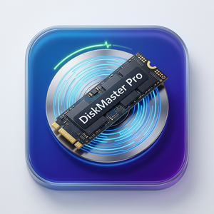

# DiskMaster Pro 

<p align="center">
  
</p>

<p align="center">
  <strong>Flagship Windows Disk Maintenance, Image Deployment, BCD Boot Manager & System Optimizer Suite</strong>
</p>

<p align="center">
  <a href="#build--compilation"></a>
  <a href="#architecture"></a>
  <a href="#architecture"></a>
  <a href="#prerequisites"></a>
  <a href="#localization"></a>
  <a href="#license"></a>
</p>

---

##  Overview

**DiskMaster Pro** is a modern, enterprise-grade Windows system maintenance and deployment utility engineered natively in **WinUI 3 (Windows App SDK)** and **.NET 9**. Designed for system engineers, IT administrators, power users, and competitive gamers, it integrates low-level disk operations, offline Windows image servicing, NVMe telemetry, BCD boot configuration, OEM driver lifecycle management, storage directory space diagnostics, and hidden kernel/CPU power tuning into a single, cohesive, high-performance application.

DiskMaster Pro runs as a **self-contained unpackaged desktop application** (`WindowsPackageType=None`), delivering zero-friction portable execution without requiring MSIX certificate provisioning or Store dependencies, while maintaining full hardware access and administrative capabilities.

---

##  Key Features

### 1.  Easy Mode & Graphical Partitioning
- **Visual Partition Sizer**: Interactive partition visualization map allowing drag-and-snap partition sizing, shrinking, and expansion.
- **Dynamic Physical Disk Selection**: Automatic hardware hot-plug detection; dynamically indexes physical disks (`SelectedDisk.Number`) with real-time sector size and partition style reporting.
- **Lossless & Direct Conversions**: One-click conversion between MBR and GPT partition tables.
- **Volume Lifecycle Management**: Format volumes (NTFS, FAT32, exFAT, ReFS), assign/remove drive letters, label volumes, and clean disks with defensive verification barriers.

### 2.  WIM / ESD Deployment Engine
- **Image Servicing & Deployment**: Apply, capture, mount, and split Windows WIM, ESD, and SWM images using native DISM pipelines.
- **Compact OS Integration**: Deploy Windows in ultra-compact compressed states (`XPRESS4K`, `XPRESS8K`, `XPRESS16K`, `LZX`) to save up to 60% of OS footprint on lightweight SSDs and embedded drives.
- **Windows 11 Hardware Bypass**: Automatic offline registry injection bypassing TPM 2.0, SecureBoot, RAM (4GB), and CPU generation checks during unattended installations.
- **Direct ISO Acquisition**: Integrated Fido / Microsoft official download helpers with HTTP Range header probing and download resume support.

### 3.  MSConfig-Style BCD Boot Manager & Safe Boot
- **Comprehensive BCD Management**: Enumerate, add, delete, rename, and backup/restore Windows Boot Configuration Data entries.
- **One-Click ESP Auto-Mount**: Safely mount and unmount hidden EFI System Partitions (`mountvol /s` / `mountvol /d`) with automatic unmount guarantees on application exit.
- **Safe Boot Modes**: Interactive selection of MSConfig-equivalent safe boot profiles:
  - `Minimal`: Core safe mode drivers only (`safeboot minimal`).
  - `Alternate Shell`: Safe mode with command prompt shell (`safeboot alternateshell`).
  - `Network`: Safe mode with active networking stack (`safeboot network`).
  - `Active Directory Repair`: Directory services recovery mode (`safeboot dsrepair`).
  - `Normal Boot`: Clean removal of safe boot flags.
- **Advanced Kernel Boot Flags**: Toggle low-level BCD switches including `noguiboot` (No GUI boot), `bootlog` (write `ntbtlog.txt`), `basevideo` (standard VGA driver), `sos` (verbose kernel driver loading), `testsigning` (test mode), `nointegritychecks` (driver signature enforcement bypass), and `hypervisorlaunchtype` (Virtualization control).

### 4.  OEM Driver Lifecycle & Force Uninstallation
- **Structured PnPUtil Enumeration**: Structured parsing and inspection of all installed 3rd-party driver packages (`pnputil /enum-drivers`).
- **Deep Driver Telemetry**: Instant display of Driver Class, Provider Name, Driver Date, Driver Version, and Signer authenticity.
- **Multi-Selection & Batch Removal**: Filter drivers by keyword, select multiple packages simultaneously, and execute batch uninstallations.
- **Force Uninstall Guardrail**: Support for `/uninstall /force` with explicit destructive operation confirmation prompts.

### 5.  Storage Directory Encyclopedia & Space Analyzer
- **Targeted Heavy Directory Scans**: Deep recursive size and item count analysis on critical Windows system folders:
- **Safety Rating Indicators**:
  - 🟢 **Safe to Purge**: Safe for immediate deletion without system impact.
  - 🟡 **Clean via System Tool / DISM**: Must be purged using native maintenance engines (`Dism /Online /Cleanup-Image /StartComponentCleanup`).
  - 🔴 **Essential Core - Do Not Delete**: Crucial OS infrastructure; manual deletion causes severe corruption.
- **One-Click Actions**: Open directly in File Explorer, trigger native safe cleanup, or launch DISM Component Cleanup.

### 6.  Hidden Performance & CPU Power Tuning
- **Ultra Gaming & Latency Optimization**:
- **Complete Hiberfil.sys Purge**:

### 7.  S.M.A.R.T. NVMe Telemetry & Reliability Monitoring
- **NVMe Log Page 0x02 Specification Compliance**: Fully compliant with NVM Express Base Specification 5.14.1.2 (correct byte offset 128 for `PowerOnHours`, offset 112 for `PowerCycles`, offset 3 for `AvailableSpare`).
- **Unprivileged Telemetry Fallback**: Graceful fallback using Windows `InstallDate` and `TickCount64` heuristics when low-level IOCTL / CIM hardware queries are restricted.
- **Clean Health Indicators**: Guarantees zero read/write error counters display as `"0"` instead of confusing `null` / `"N/A"`.

### 8. 🌐 Network Tools, UPnP Port Forwarding & 5-Stage Diagnostics
- **UPnP Automatic Port Forwarding**: High-performance COM NATUPnP gateway discovery for automatic router port mapping; includes 1-click popular gaming and server presets (Minecraft 25565, Steam 27015, Palworld 8211, Terraria 7777, Remote Desktop 3389, Plex 32400).
- **Recommended Public DNS Engine**: Rapidly test and switch system DNS to Cloudflare (1.1.1.1), Google (8.8.8.8), Quad9 Malware Blocking (9.9.9.9), AdGuard Tracker Blocking (94.140.14.14), HiNet, TWNIC, or restore router DHCP.
- **5-Stage Smart Bottleneck Diagnosis**: Automatically assesses Gateway Ping, DNS resolution speed, Backbone Latency, Outbound TCP handshake, and Network Adapter hardware error counts.
- **Visual Hosts File Editor**: Structured table editor for `%SystemRoot%\System32\drivers\etc\hosts` with inline toggle, comments, automated `.bak` backups, and instant DNS cache flushing.

### 9. ☁️ OneDrive Deep Governance & 5-Issue Repair
- **Real-Time Detection & Selective Display**: Detects OneDrive installations and background execution, dynamically exposing repair and uninstallation cards only when relevant.
- **Fix Known Folder Move Hijacking**: Reverts hijacked Desktop, Documents, and Pictures folders back to clean local `%USERPROFILE%` paths.
- **Files On-Demand Guardrail**: Automatically scans for cloud-only dehydrated placeholders before uninstallation to protect users from accidental data loss.
- **Ghost Sidebar Icon Elimination**: Safely strips orphaned Explorer namespace registry pins (`018D5C66-4533-4307-9B53-224DE2ED1FE6`).
- **Infinite Sync Loop Reset**: Resolves stuck "Processing Changes" loops via `onedrive.exe /reset` and local cache purges.
- **Group Policy Reinstall Lock**: Sets `DisableFileSyncNGSC = 1` in policy registry to permanently prevent Windows Update from silently reinstalling OneDrive.

### 10. 🎯 Beginner Starter Hub & Dual-Mode UI Switcher
- **Beginner Starter Hub**: Features an automated 0-100 system health score and 1-click optimization cards (Game Latency Boost, 1-Click SSD Reclamation, System Integrity Repair, OneDrive Cleanup).
- **Easy vs Advance Dual-Mode Switcher**: Instantly toggles between streamlined Beginner Mode and full-spectrum Advance Toolbox directly from the top tab strip.
- **System Tray Background Minimization**: Native Win32 `Shell_NotifyIcon` integration supporting background minimization, click-to-restore, and close-to-tray.
- **Taskbar Flash & Windows Audio Feedback**: Native `FlashWindowEx` taskbar flashing on warnings and completions, paired with native Windows `MessageBeep` audio alerts.
- **GitHub Releases Auto-Updater**: Real-time update checks against official GitHub releases with configurable check intervals and direct asset downloads.

### 11. 🪟 Modern Fluent Interface & Movable Chrome Tabs
- **Fully Draggable & Movable Tabs**: All main tabs and sub-tabs support drag-and-drop mouse reordering (`CanReorderTabs="True"`, `CanDragTabs="True"`).
- **Tab Tear-Off & Multi-Window Docking**: Drag tabs outside the main window to instantly detach them into standalone `FloatingTabWindow` instances; effortlessly drag back or use one-click "Dock All".
- **Dynamic Fluent Design**: Fluent Acrylic, Mica Alt material, smooth transitions, and high-DPI crisp rendering.
- **Full 4-Language Hot-Swap Parity**: Dynamic runtime language switching between Traditional Chinese (`zh-TW`), Simplified Chinese (`zh-CN`), English (`en-US`), and Japanese (`ja-JP`).

---

##  Architecture & Engineering Design

```
DiskMasterWinUI/
├── App.xaml / App.xaml.cs                 # WinUI 3 Application Lifecycle & Theme Host
├── MainWindow.xaml / .cs                  # Primary Window, TabView Host & Floating Orchestration
├── Package.appxmanifest                   # Windows Application Packaging Manifest
├── Assets/                                # Fluent Application Icons & Splash Assets
├── Controls/                              # Custom WinUI 3 Controls
│   ├── FloatingTabWindow.xaml / .cs       # Detached Chrome-Style Window Host
│   ├── StatusBarControl.xaml / .cs        # Global Activity & Progress Status Bar
│   └── AdobeSplitter.xaml / .cs           # High-precision Drag-and-Snap Resizable Splitter
├── Helpers/                               # Concurrency, Diagnostics & Win32 Interop Helpers
│   ├── ProcessHelper.cs                   # Deadlock-free Concurrent Stream Subprocess Runner
│   ├── BootGuardHelper.cs                 # Defensive BCD and ESP Mount Protection Guard
│   ├── DialogHelper.cs                    # 4-Language Destructive Operation Safety Dialogs
│   └── OutputParser.cs                    # PnPUtil, DiskPart, and BCD Output Tokenizer
├── Models/                                # Domain Models & Telemetry DTOs
│   ├── OemDriverItem.cs                   # Structured PnP OEM Driver Entity
│   ├── StorageEncyclopediaItem.cs         # System Directory Metadata & Safety DTO
│   ├── BootEntryDetail.cs                 # BCD Entry Representation
│   └── DiskReliabilityInfo.cs             # S.M.A.R.T. & NVMe Telemetry Data Model
├── Services/                              # Core Service Layer
│   ├── ProcessHelper.cs                   # Concurrency-Safe Subprocess Runner
│   ├── DriverService.cs                   # PnPUtil Driver Enumeration & Removal Service
│   ├── StorageAnalyzerService.cs          # Recursive Directory Space & Safety Engine
│   ├── BcdManagerService.cs               # BCDedit & Safe Boot Configuration Engine
│   ├── PowerCfgService.cs                 # PowerCfg & Hidden CPU Power Tuning Service
│   ├── SmartReaderService.cs              # NVMe Log Page 0x02 IOCTL & S.M.A.R.T. Telemetry
│   ├── SettingsService.cs                 # Persistent JSON AppSettings Storage
│   └── LocalizationService.cs             # 4-Language Parity Dictionary & Hot-Swap Engine
└── ViewModels/                            # MVVM ViewModels (CommunityToolkit.Mvvm)
    ├── EasyModeViewModel.cs
    ├── WimDeployViewModel.cs
    ├── BootManagerViewModel.cs
    ├── DiskToolsViewModel.cs
    └── SystemOptimizerViewModel.cs
```

### Concurrent Process Runner (`ProcessHelper`)
To prevent the classic Windows anonymous pipe 4KB buffer deadlock bug (where a child process blocks when writing to `stderr` while the parent synchronously reads `stdout`), `ProcessHelper` consumes `StandardOutput` and `StandardError` streams concurrently using `Task.WhenAll`:
```csharp
var stdoutTask = process.StandardOutput.ReadToEndAsync(cancellationToken);
var stderrTask = process.StandardError.ReadToEndAsync(cancellationToken);
await Task.WhenAll(stdoutTask, stderrTask, process.WaitForExitAsync(cancellationToken));
```

---

##  Tuning Benchmarks & Technical Analysis

### 1. CPU Quantum Scheduling (`Win32PrioritySeparation`)
| Configuration | Hex Value | Quantum Length | Priority Boost Ratio | Target Workload |
|:---|:---:|:---:|:---:|:---|
| Windows Default (Desktop) | `0x02` | Variable (12 ticks) | 3:1 Foreground Boost | Standard Office / Multitasking |
| Windows Server Default | `0x18` | Fixed (36 ticks) | 1:1 Equal Priority | Background Server Daemons |
| **DiskMaster Pro Gaming Mode** | **`0x26`** | **Short (6 ticks)** | **High 3:1 Dynamic Boost** | **Competitive Esports / High FPS** |

*Benefit: 0x26 minimizes the interval before high-priority input handling and game engine render threads are scheduled, reducing 1% low frame time variance.*

### 2. SSD Disk Space Reclamation Benchmarks
| Component / Directory | Typical Unoptimized Size | Method Executed | Typical Reclaimed Space |
|:---|:---:|:---|:---:|
| `C:\hiberfil.sys` | 16 GB - 64 GB | `PowerCfgService.SetHibernationAsync(false)` | **16.0 GB - 64.0 GB** |
| `WinSxS` Component Store | 12 GB - 25 GB | DISM ResetBase Component Cleanup | **4.0 GB - 10.0 GB** |
| `SoftwareDistribution\Download` | 5 GB - 15 GB | Safe Service Stoppage & Cache Flush | **5.0 GB - 15.0 GB** |
| `Windows.old` Upgrade Cache | 20 GB - 40 GB | Storage Analyzer Safe Cleanup | **20.0 GB - 40.0 GB** |

---

##  Safety Guardrails & Defensive Engineering

1. **Non-Destructive Defaults**:
   All critical disk operations (DiskPart Clean, Format, Delete Partition, Driver Force Delete, Safe Boot configuration) require explicit user confirmation through `DialogHelper.ConfirmDestructiveOperationAsync`.
2. **Automated BCD Backups**:
   Before modifying any boot configuration entries or switching Safe Boot modes, DiskMaster Pro offers automatic BCD registry export (`BcdExportCommand`).
3. **Guaranteed ESP Unmount**:
   When mounting the hidden EFI System Partition to `S:`, the mount state is registered with `BootGuardHelper`. If the application closes, crashes, or unloads, `mountvol /d` is deterministically executed in the process teardown pipeline to prevent exposed ESP partitions.
4. **Administrator Privilege Enforcement**:
   Operations requiring `SeSystemEnvironmentPrivilege`, `SeLoadDriverPrivilege`, or raw volume write access verify elevation via `WindowsPrincipal.IsInRole(WindowsBuiltInRole.Administrator)`. An elevation bar offers one-click restart with elevated UAC credentials.

---

## 🌐 Localization Parity

DiskMaster Pro delivers **100% translation parity** across all supported locales:
- **`zh-TW`**: 繁體中文 (Traditional Chinese - Taiwan)
- **`zh-CN`**: 简体中文 (Simplified Chinese - China)
- **`en-US`**: English (United States)
- **`ja-JP`**: 日本語 (Japanese)

Languages can be hot-swapped instantly in `SettingsPage` without restarting the application. All UI labels, tooltips, dialogs, warnings, and directory encyclopedia descriptions update reactively via `LocalizationService.Instance.LanguageChanged`.

---

##  Build & Compilation Guide

### Prerequisites
- **Operating System**: Windows 10 Version 1809 (Build 17763) or Windows 11 (all versions up to 24H2).
- **.NET SDK**: .NET 9 SDK (`9.0.100` or newer).
- **Workload / Tools**: Windows App SDK Build Tools (restored automatically via NuGet).

### Step-by-Step Build

1. **Clone the Repository**:
   ```powershell
   git clone https://github.com/YourOrg/DiskMasterWinUI.git
   cd DiskMasterWinUI
   ```

2. **Restore Dependencies**:
   ```powershell
   dotnet restore
   ```

3. **Compile Release Target (Zero Warnings Guarantee)**:
   ```powershell
   dotnet build -c Release
   ```
   *Expected Output: `Build succeeded. 0 Warning(s), 0 Error(s)`.*

4. **Publish Standalone Package**:
   ```powershell
   dotnet publish -c Release -r win-x64 --self-contained
   ```

5. **Generate Inno Setup Installer** (Optional):
   ```powershell
   iscc DiskMasterSetup.iss
   ```

---

## 📄 License

DiskMaster Pro is licensed under the **MIT License**. See `LICENSE` for details.
